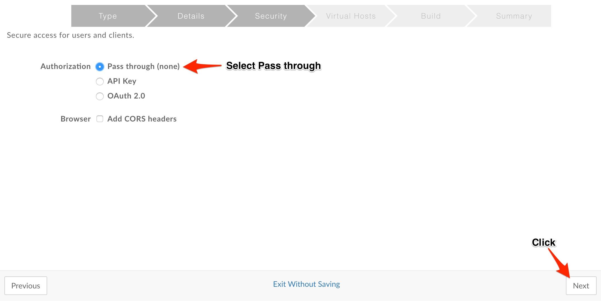

# API Development : Hosted Targets

*Duration : 20 mins*

*Persona : API Team*

# Use case

You have a proxy requirement where you want to aggregate the results of several API calls and to massage the output from each. These separate API calls should be executed in parallel.

# How can Apigee Edge help?

Hosted Targets provide a mechanism where customers can combine the rich support of policies with node.js apps deployed automatically by Apigee. The use case described here is best solved with real code. Through some simple code a developer can unambiguously handle the individual calls, aggregate and massage the output and with an eye to parallel execution.

In this lab we'll be creating a hosted target that utilizes node.js to parallelize several backend calls and then combine the results into a single response.

# Pre-requisites

* Basic understanding of [node.js](https://nodejs.org/en/) (Serverside Javascript)

# Instructions

## Create a "Hosted Target" API Proxy

1. It’s time to create Apigee API Proxy from Open API Specification. Click on **Develop → API Proxies** from side navigation menu.


2. Click **+Proxy** The Build a Proxy wizard is invoked. 


3. Select **Reverse proxy**, Click on **Use OpenAPI** below reverse proxy option.


4. Enter details in the proxy wizard. Replace **{your-initials}** with the initials of your name. 

    * Proxy Name: **{your_initials}**_hf_proxy

    * Proxy Base Path: /v1/**{your_initials}**_hf_proxy


5. Select **Pass through (none)** for the authorization in order to choose not to apply any security policy for the proxy. Click Next. 



6. Go with the **default Virtual Host** configuration.


7. Ensure that only the **test** environment is selected to deploy to and click **Build and Deploy** 


8. Once the API proxy is built and deployed **click** the link to view your proxy in the proxy editor. 


9. *Congratulations!* ...You have now built a hosted target proxy. You should see the proxy **Overview** screen.


## Test the API Proxy
1. Let us test the newly built API proxy by copying the url and hitting it in a new tab in the browser. If all is well it should return "Hello, World!"


## Extend the proxy with new functionality

The default proxy isn't very interesting. Let's extend it a bit. First let's update the package.json file.

1. Let's move into the development view


2. Next click on `package.json` from the scripts view in the lower left hand navigation pane.


3. Update the package.json as per the following. We're adding threw new dependencies that the hosted targets service will automatically install for us and which we'll need going forward.

```javascript
{
  "name": "hello-world",
  "version": "1.0.0",
  "main": "index.js",
  "scripts": {
   "start": "node index.js"
  },
  "author": "",
  "license": "",
  "description": "Hello World Application",
  "dependencies": {
    "bluebird": "^3.5.1",
    "express": "^4.16.2",
    "node-fetch": "^1.7.3"
  }
}
```

4. Click on the `index.js` script to update it.


5. Update the script with the following. This is a complete rewrite that's now relying on two of the three dependencies we added when we updated `package.json`

```javascript
const express = require('express'),
  fetch = require('node-fetch');

const app = express();

app.get('/', (req, res) => {
  res.status(200).send('Hello, world!').end();
});

// Start the server
const PORT = process.env.PORT || 8080;
app.listen(PORT, () => {
  console.log(`App listening on port ${PORT}`);
  console.log('Press Ctrl+C to quit.');
});
```

6. Save the newly updated script


7. Test our new script by refreshing the tab we previewed earlier and you should see a simple text line reading: `Hello, World!`.

# Quiz

1. Could you add traditional policies to the hosted target?

# Summary

That completes this hands-on lesson. In this simple lab you learned how to create a proxy for an existing backend using OpenAPI Specification and Apigee Edge proxy wizard.

# References

* TBD ... we don't have anything to link here yet


# Rate this lab

How did you like this lab? Rate .. to be filled in later

