# Lab 5 - Measure API Program Success with Apigee Analytics

**Last Updated:** 2019-09-03

*Duration : 20 mins*

*Persona : API Product Team*

# Use Case

## What comes after publishing the first API Product

After you have some API Products up and running you want to have a look at how the program performs and how successful your API program is.

* How is traffic trending over time?

* When is the traffic flowing fastest?

* Where are the most users?

* What are the most active developers?

### Insights help with capacity planning

With trend usage data you can see how your API calls are trending over time and predict how the traffic will be in the next year, when you need to do your capacity planning

Through visualization of the data with out of the box analytics, Apigee helps you with finding the trends and patterns of your APIs

### Tying traffic to API Products

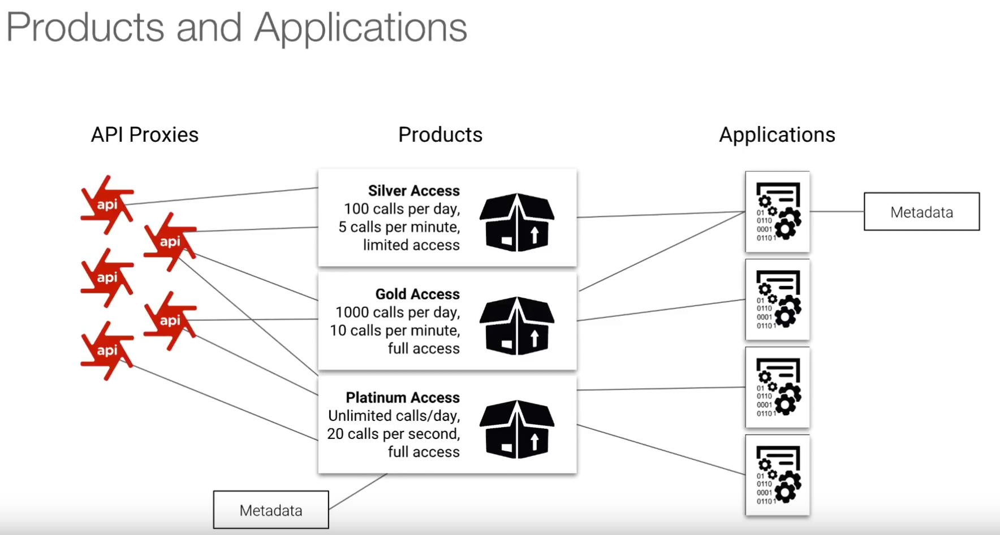

When registering an application to an API product that metadata is loaded when verifying an API key or Oauth Token so you can identify the Developer, App and the Product. This data is crucial for insights into your program.

# Pre-requisites

* If you have followed previous modules you can probably already see some traffic for the proxies you have created earlier and work with your previous API proxy for the custom statistics.

* If you haven't followed previous models you can follow this lab too but will see less data in your dashboards.

* (Optional) If you want the full experience setup a load generator before to see some data in your dashboards.

# (optional) Add some load to API proxies

If you have not followed previous modules you can use a load generator to have some data in your reports.

You have to have an API proxy with a default API key policy and 3 API keys ideally for different Apps and API products.

## Configure and Run Load Generator

You can create a new proxy by uploading the proxy in the *loadgen* folder in this repository.

1. Create a new proxy by clicking **Develop > API Proxies > + Proxy**

2. In the new proxy wizard select to upload a proxy bundle and upload your .zip file from the repository.

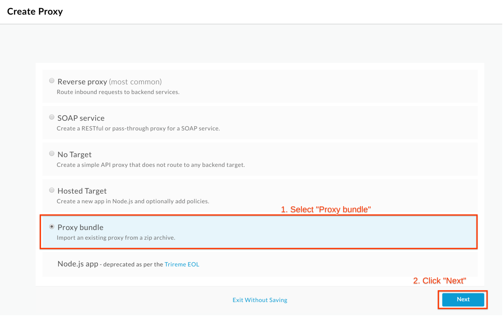

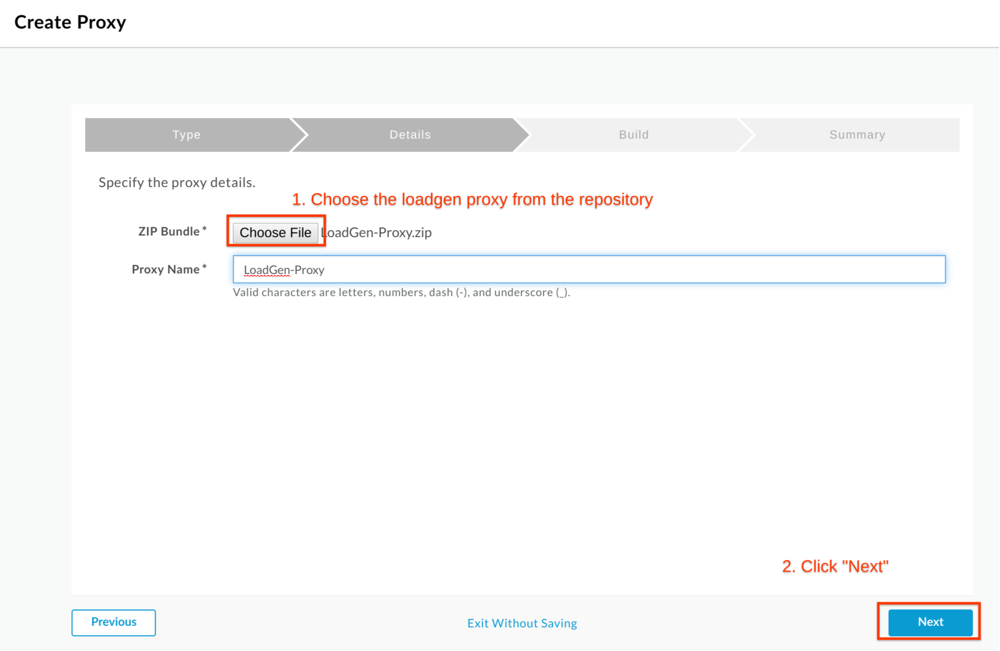

3. Click **Build.**

4. After the proxy was created you can directly open it in the editor and go to the **Develop** tab to change the values for your proxies and api keys.

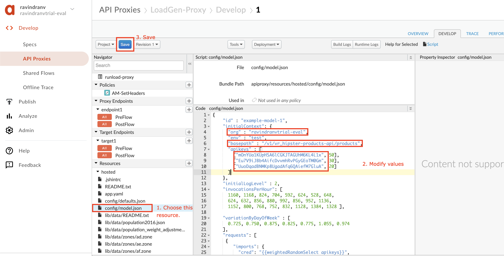

5. After changing the values **Save** and **deploy** the proxy and run the proxy from the **Trace** tab.

6. Let the load generator run for a while and **undeploy** it to make it stop producing traffic.

# Understand API usage using the pre-built Apigee analytics dashboards

Apigee comes with a lot of pre built reports. For the purpose of these labs and in the interest of time, we will walk through the different dashboards with screenshots from populated demo environments. Feel free to use the optional load generator to follow along in your own environment.

If you prefer you can have a look at the API Dashboards by watching this video that gives you an overview of the metrics dashboards with a lot of filled values: [https://youtu.be/mElNO44QQFQ?t=126](https://youtu.be/mElNO44QQFQ?t=126)

To get to the reports open the **Analyze** menu in the sidebar.

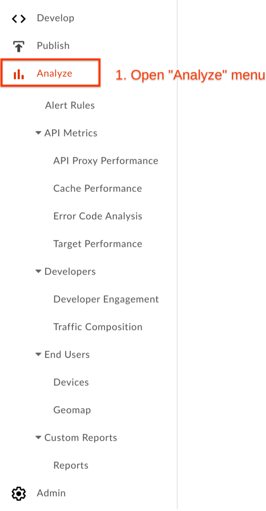

## API Proxy Performance

The Proxy Performance dashboard helps you see API proxy traffic patterns and processing times. You can easily visualize how much traffic your APIs generate and how long it takes for API calls to be processed, from the time they are received by Apigee Edge until they are returned to the client app.

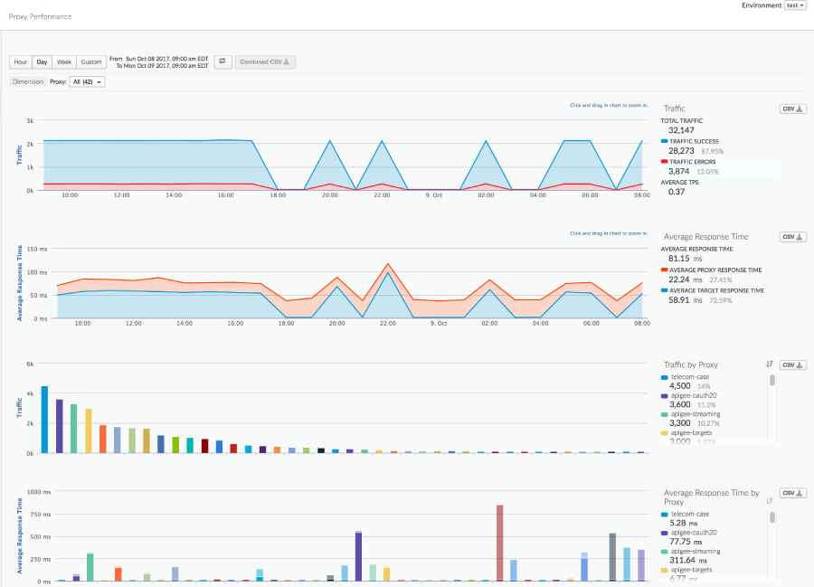

## Cache Performance

The Cache Performance dashboard lets you see at a glance the value of your Apigee Edge cache. The dashboard helps you visualize the benefit of the cache in terms of lower latency and reduced load backend servers.

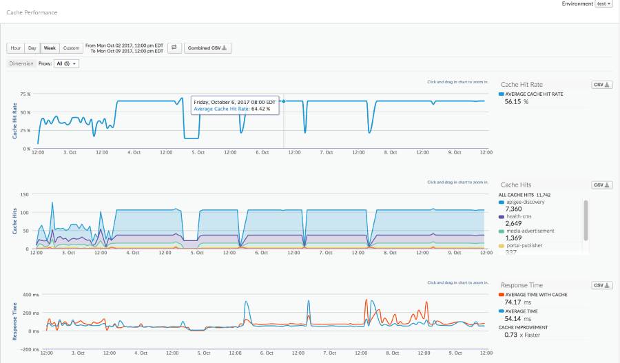

## Error Code Analysis

The Error Code Analysis dashboard tells you about error rates for API proxies and targets. The Error Code Analysis dashboard uses:

* The response code to calculate proxy errors

* The target response code to calculate target errors


## Target Performance

The Target Performance dashboard helps you visualize traffic patterns and performance metrics for API proxy backend targets.

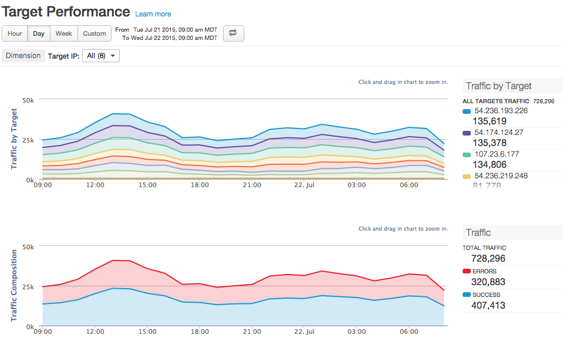

## Developer Engagement

The Developer Engagement dashboard tells you which of your registered app developers are generating the most API traffic. For each of your developers, you can find out who is generating the most API traffic and the most errors. For example, if a particular developer's app is generating a lot of errors relative to other developers, you can pro-actively address the problem with that developer.


In the main view, if it is enabled, select the **Analyze** button under the **Actions** column for the app to view details about that app and the app developer. The following chart appears:


## Traffic Composition

The Traffic Composition dashboard measures the relative contribution of your top APIs, apps, developers, and products to your overall API program.

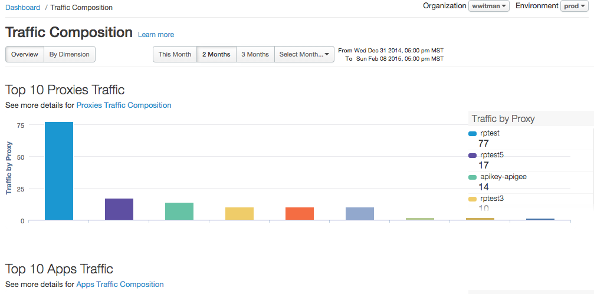

## Devices

The Devices dashboard tells you about the devices and servers that are being used to access your APIs. It lets you spot trends in how users are accessing your APIs. For instance, you might notice that traffic from one type of device is increasing, while another is going down, and then decide if the change requires any action or not.

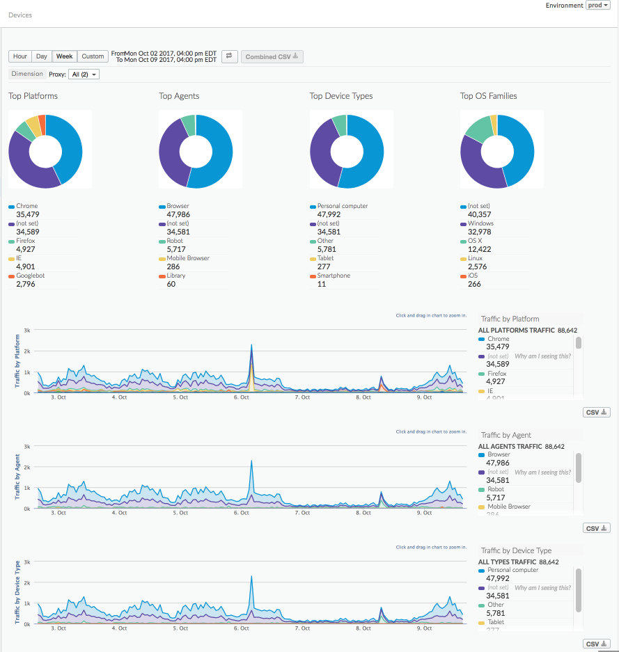

## Geomap

The Geo Map dashboard tracks traffic patterns, error patterns, and quality of service across geographical locations. You can view information about all your APIs, or zoom in on specific ones.


# Create a custom analytic report

## Add Statistics Collector

1. Click on **Develop → API Proxies** from side navigation menu. Open the existing API Proxy from the prerequisites and go to the Develop tab.

2. To get the data from the path we need to extract it into an Apigee Flow variable first. We do this by adding an **Extract Variables** policy.

3. In the **GetProductDetails **Flow add a new step to the request by clicking the "**+ Step**" button


4. Add an **Extract Variables** Policy under the "Mediation" category.


5. Add an **Extract Variables** Policy under the "Mediation" category.

```
<ExtractVariables name="ExtractVariables-1">
   <DisplayName>EV-ExtractProductID </DisplayName>
   <Source>request</Source>
   <URIPath>
      <Pattern ignoreCase="true">/products/{productId}</Pattern>
   </URIPath>
   <VariablePrefix>urirequest</VariablePrefix>
   <IgnoreUnresolvedVariables>true</IgnoreUnresolvedVariables>
</ExtractVariables>
```

6. In the **GetProductDetails** add a new step to the request by clicking the "**+ Step**" button


7. Add a **Statistics Collector** Policy under the "Extensions" Category.


8. Edit the new **Statistics Collector** policy and provide it with the following values.

```
<?xml version="1.0" encoding="UTF-8" standalone="yes"?>
<StatisticsCollector async="false" continueOnError="false" enabled="true" name="Statistics-Collector-1">
    <DisplayName>SC-CollectStatistics</DisplayName>
    <Properties/>
    <Statistics>
        <Statistic name="productID" ref="urirequest.productId" type="STRING"/>
    </Statistics>
</StatisticsCollector>
```

9. Run a trace session. Click on the **Trace** tab and click **Start Trace Session** to start a trace session. Enter the api key from one of your Apps as a query parameter before clicking **Send.** Click on the **Extract Variables Policy Icon** to see the value in a variable. This value is picked up by our Statistics Collector policy.

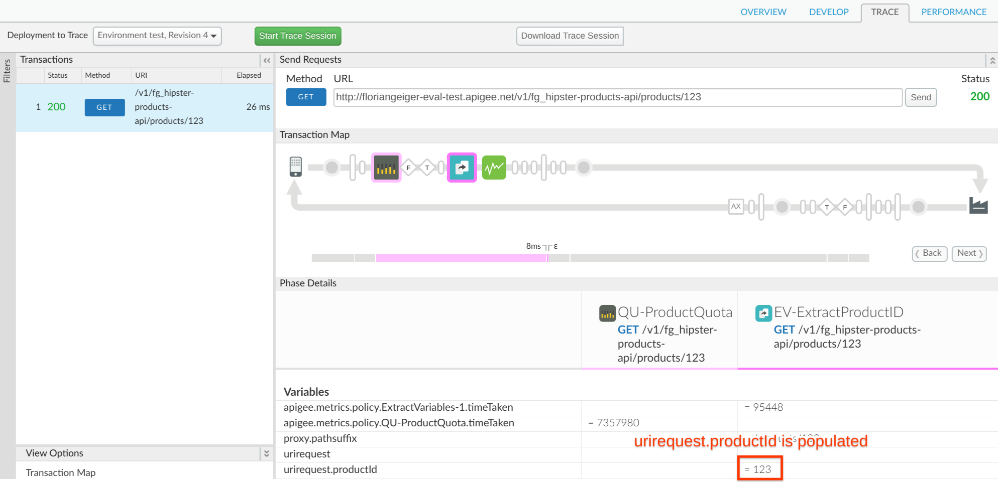

Play around with different api keys from different API 

> Note: It takes about 30 minutes for a new custom dimension to be added to the database after the Statistics Collector policy is invoked for the first time, for each environment.
>  
> For example, if a Statistics Collector proxy is invoked in the test environment, data for that custom dimension starts to be available in the test environment 30 minutes later, and the custom dimension will appear in the custom reports Dimensions drop-down list.


## Create custom report

Now we want to have a look at the data we collected in our API proxy. To do that we need to create a custom report that looks for the value we have defined in the statistics collector policy before.

1. Under **Analyze > Custom Reports > Reports** open the Custom Reports Menu

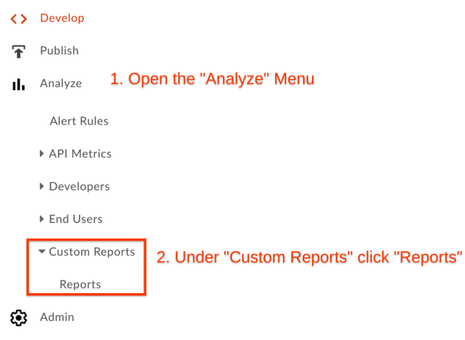

2. Click + Custom Report to create a new custom report


3. Now we can give the custom report a descriptive report name and report description. We also want to define the metric we want to see in our Y-axis. A custom statistic variable could also be here if we would have defined it as an integer rather than a string.

For our example we want to see the **Traffic** of our proxy

We also define the Dimensions we want to group our traffic by. By selecting multiple dimensions we can drill down our report to find more information on the traffic metric.

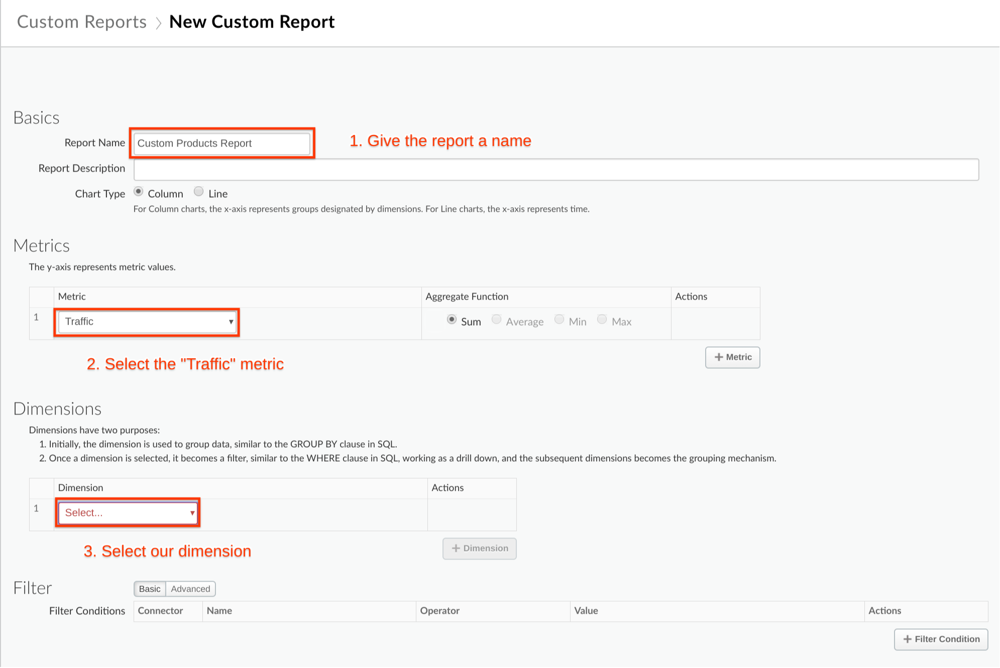

4. In this lab we want to use these dimensions to demonstrate the drill down functionality. For this we chose **Country, Developer App **and** productId** as our dimensions.


5. Take a look at the other dimensions to choose from. Besides our productID that we defined in our statistics collector policy you will find other common dimensions predefined by Apigee.


6. When finished click **Save** at the bottom right.

7. In the report chose a proper range to filter. Make sure you are starting now or in the future and look back long enough. Maybe 1 hour as the default is too short.

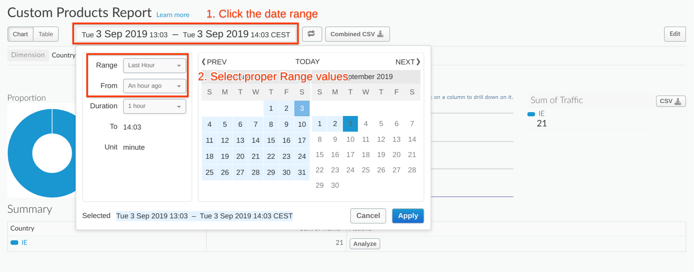

8. Now you see the traffic grouped by our first dimension. In our case all of our traffic is coming from IE. In your case this will be different and in production this will definately be more diverse.

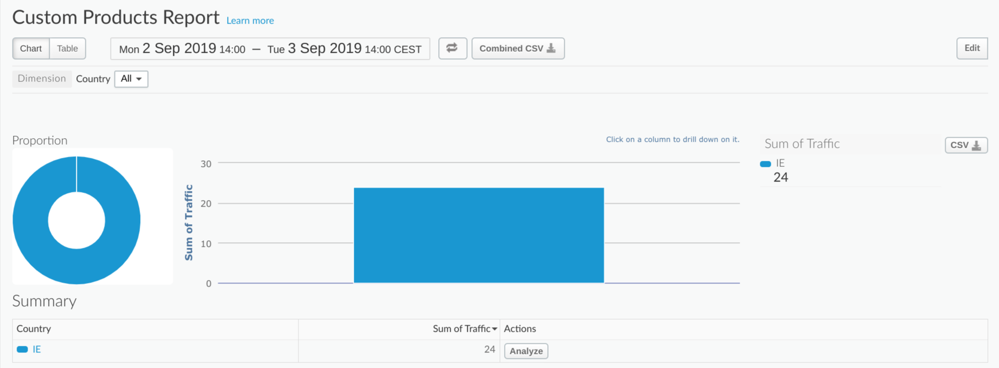

9. Drill down into the report by clicking the blue column.

Now we see the traffic split by Apps. This helps us to identify apps that are generating a lot of traffic to look closer at.

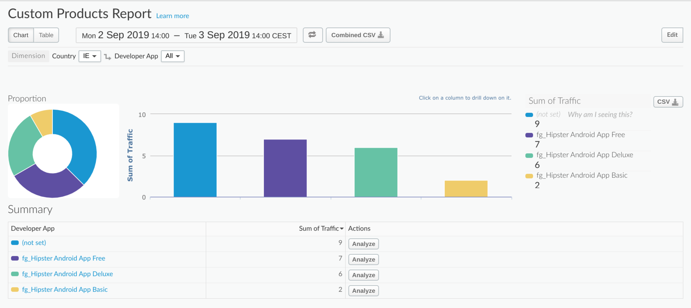

10. Let's look at the **fg_Hipster Android App Free** for example.


11. Now we see the product IDs that were fetched.

You can also download the data as CSV by clicking the download button to the right.

## Get Statistics via Management API

Visit the Management API documentation where you can also conveniently try out API calls:

[https://apidocs.apigee.com/management/apis/get/organizations/%7Borg_name%7D/environments/%7Benv_name%7D/stats/%7Bdimension_name%7D-0](https://apidocs.apigee.com/management/apis/get/organizations/%7Borg_name%7D/environments/%7Benv_name%7D/stats/%7Bdimension_name%7D-0)

### Enter the values and execute an API call

In the documentation you can interactively make calls to your organization to see how the results look like.

* Enter your the API call data in the blue **Resource URL** fields:

    * {org_name}: your organization

    * {env_name}: your environment

    * {dimension_name}: apiproxy

* Fill in the data in the table:

    * Select: sum(message_count)

    * timeRange: 08/01/2019 00:00~08/30/2019 23:59

    * Filter: (apiproxy eq 'weather-analytics')

> Caution: Update Time Range accordingly to have the end range date in the present.

* Authenticate with your Apigee username and password that you use to login into the Admin UI.

* Send a request by clicking the **Send this request** button


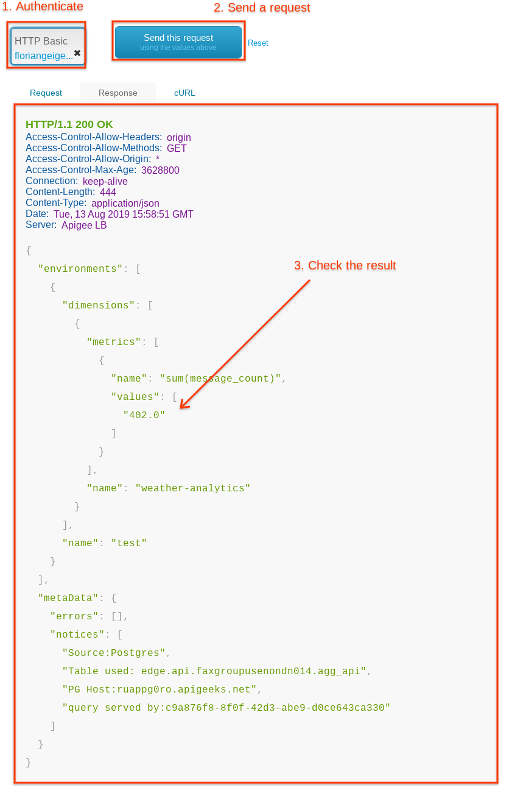

# Quiz

* Why did this lab use the data type string in productId although its numerical values in the API specification?

* What happens if you put multiple statistics collectors in the proxy flow?

# Summary

In this lab you have explored all Reports that show you the success and performance of you API Program and give you valuable insights into how to optimize your APIs.

## What we've covered

* Overview of the built in Apigee Dashboards

* Modified a proxy to collect custom statistics data

* Create a custom report using the data from API calls and defining dimensions to drill down for more details.

# References

## Apigee Docs Links

[https://docs.apigee.com/api-platform/analytics/use-analytics-api-measure-api-program-performance](https://docs.apigee.com/api-platform/analytics/use-analytics-api-measure-api-program-performance)

Analytics dashboards overview - [https://docs.apigee.com/api-platform/analytics/using-analytics-dashboards](https://docs.apigee.com/api-platform/analytics/using-analytics-dashboards)

Exract Variables Policy - [https://docs.apigee.com/api-platform/reference/policies/extract-variables-policy](https://docs.apigee.com/api-platform/reference/policies/extract-variables-policy)

Statistics Collector Policy - [https://docs.apigee.com/api-platform/reference/policies/statistics-collector-policy](https://docs.apigee.com/api-platform/reference/policies/statistics-collector-policy)

Create and manage custom reports - [https://docs.apigee.com/api-platform/analytics/create-custom-reports](https://docs.apigee.com/api-platform/analytics/create-custom-reports)

Example of custom report with statistics collector - [https://docs.apigee.com/api-platform/analytics/analyze-api-message-content-using-custom-analytics](https://docs.apigee.com/api-platform/analytics/analyze-api-message-content-using-custom-analytics)

## Videos (4mv4d)

Extract Variables Policy - [https://www.youtube.com/watch?v=KqFpnNt_8yo](https://www.youtube.com/watch?v=KqFpnNt_8yo)

Measurement and KPIs for APIs - [https://www.youtube.com/watch?v=x6r7xHKNINU](https://www.youtube.com/watch?v=x6r7xHKNINU)

Measuring and reporting the success of your API program - [https://www.youtube.com/watch?v=VcNKpoakVqQ](https://www.youtube.com/watch?v=VcNKpoakVqQ)