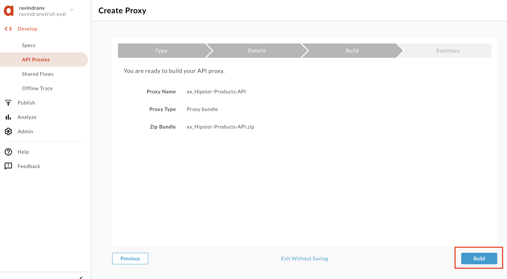
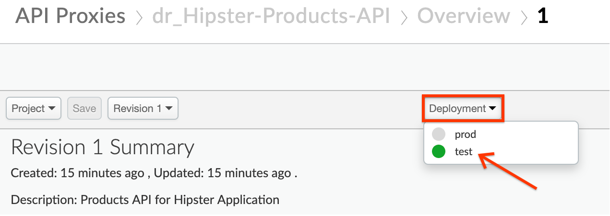
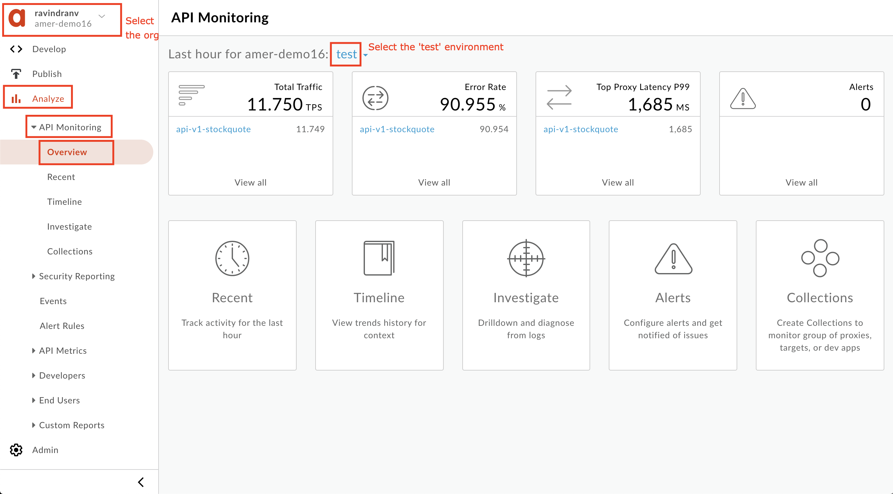

# Lab 2 : API Monitoring

*Duration : 10 mins*

*Persona : API Team / Security*

# Use case

After you launch your API program, the operations team is typically responsible for ensuring that the APIs are available and performing as expected to maintain a seamless experience for your consumers.

Proactive detection of API traffic and performance issues is a key component to the team's success. As API traffic increases, without access to in-depth data analysis and contextual alerting, the ability to meet customer service-level agreements (SLAs) may be put at risk.

# How can Apigee Edge help?

[**Apigee API Monitoring**](https://docs.apigee.com/api-monitoring) helps operations teams increase API availability for application developers, customers, and partners. Apigee API Monitoring works in conjunction with Apigee Edge Cloud (SaaS) to provide real-time contextual insights into API performance, helps quickly diagnose issues, and facilitates remedial actions for business continuity.

By exposing an API through Apigee Edge, in addition to API lifecycle management, you gain the ability to monitor its behavior using the out-of-the-box API Monitoring feature. While Edge's out-of-the-box policies enable you to enhance your API with sophisticated features to control traffic, enhance performance, enforce security, and increase the utility of your APIs, without requiring you to write any code or to modify any backend services, API Monitoring helps you monitor various operational aspects of the API, and alert your operations team when events such as traffic throttling limits occur.

In this lab we will see how to use [**Apigee API Monitoring**](https://docs.apigee.com/api-monitoring) to proactively notify you ops team of traffic spikes. A Spike Arrest policy is already applied to your API proxy, and can throttle the number of requests processed by an API proxy and sent to a target backend, thereby protecting against performance issues and downtime.

# Prerequisites

For this lab, please ensure that you have an API Proxy with a [Spike Arrest policy](https://docs.apigee.com/api-platform/reference/policies/spike-arrest-policy) applied, as indicated in [Module 2a Lab 1 - Throttle APIs](../../../Module-2a/Labs/Lab%201).

# Instructions

## Deploy an API Proxy

1. Go to [https://apigee.com/edge](https://apigee.com/edge) and log in. This is the Edge management UI. 

2. Select **Develop → API Proxies** in the side navigation menu.

3. If you have already completed API Jam [Module 2a Lab 1 - Throttle APIs](../../../Module-2a/Labs/Lab%201), you should see the **{yourinitials}_Hipster-Products-API** proxy that was created as part of that lab.

### If you do not already have the API Proxy

   If you do not already have the API Proxy, please complete the steps below:
   * Download [this API Proxy bundle](../Resources/xx_Hipster-Products-API_Lab2.zip?raw=true).

   * Under **Develop → API Proxies** click the **+ Proxy** button.
   

   * In the subsequent wizard, select the **Proxy bundle** option, and click **Next**.
   

   * Click **Choose file** and upload the API Proxy zip bundle you previously downloaded. Replace the API Proxy name prefix '`xx`', with your initials. You do this so that you're not breaking any other user's work within the same Apigee Edge org. Then click **Next**.
   

   * Review API Proxy details and click **Build**.
   

   * Once the proxy is uploaded, click the link to open the proxy.
   

   * Click the **Develop** tab to edit the proxy configuration. Select the '**default**' Proxy Endpoint and edit the basepath as shown below, to `/v1/{{your initials}}_hipster-products-api`. Then click the **Save** button to save the changes.
   

### If you already have the Hipster API Products proxy built from previous API Jam

If you already have the Hipster API Products proxy built from API Jam [Module-1](https://github.com/aliceinapiland/apijam/tree/master/Module-1) deployed in your Apigee Edge org, no other setup is required.

4. Ensure that the **latest revision** (it may not be 'Revision 1' as shown below), of the API Proxy is deoployed to the `test` environment. Click the **Deployment** drop down and select the **test** environment to deploy the proxy to the test environment:

Let us now add rate limit alerts to this org and environment, to alert when the Spike Arrest policy within this API proxy is triggered.

## Create an Alert

1. Log in to the [Apigee Edge Management UI](https://apigee.com/edge) as a user with an appropriate role.

**Note: To access API Monitoring within your Apigee Edge Org, you should be assigned an appropriate [API Monitoring role](https://docs.apigee.com/api-monitoring/access#api_monitoring_roles), such as "API Monitoring Admin", "API Monitoring User", "Org Admin", Read-only Org Admin" or "Operations Admin".**

2. Switch to the organization that you want to monitor, and navigate to **Analyze -> API Monitoring -> Overview**. This displays the API Monitoring dashboard, which is a summary view of API monitoring for all API proxies deployed to the selected environment in your organization.

3. To set up a monitoring alert, click the **Alerts** button.

4. Click the **+ Alert** button.

5. 